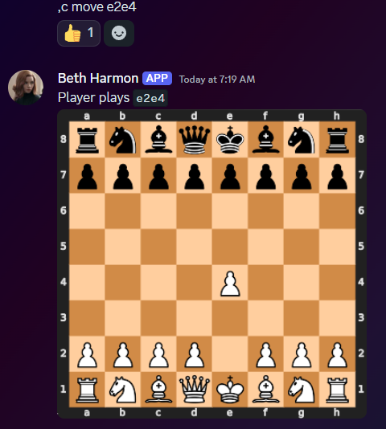
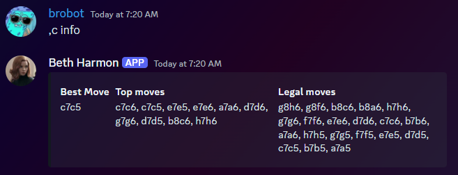
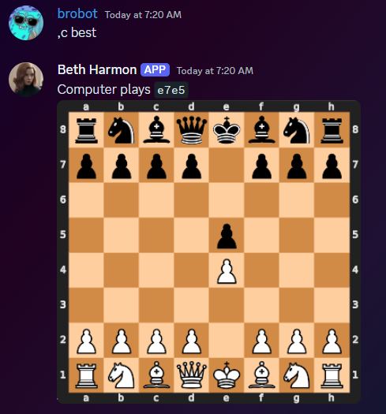

# Overview

A Discord bot for playing and exploring the game of Chess, using the `chess` and `stockfish` Python libraries. Intended for learning purposes and not a true competitive means to play the Game; [Chess.com](https://chess.com) and [Lichess](https://lichess.org/) are great for that.

## Features

* Play against the [Stockfish](https://stockfishchess.org/) engine
    * **DISCLAIMER**: this is a very basic, work in-progress implementation of the Chess game and not all rules & conditions have been verified
* List legal moves and generate the best & top moves using Stockfish

# Requirements

1. Outside of `requirements.txt`, these packages are required on the system running the bot:

* [ImageMagick](https://imagemagick.org/script/download.php)
* [Stockfish](https://stockfishchess.org/download/)

If the host system is Ubuntu/WSL, the dependencies can easily be installed via `apt install imagemagick stockfish`. If ran as a container, these dependencies are included in the `Dockerfile`.

2. TODO .env file setup

# Adding a bot to a server

TODO

# TODO

* Add configuration for adjusting Stockfish ELO & skill-level
* GIF generation of full games
* Game archival

# License

TODO

